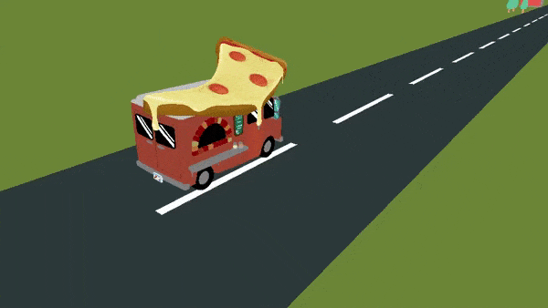

# Fastest Pizza Delivery (WIP)

A fun little 3D game made for the [Game (Engineless) Jam](https://itch.io/jam/engineless-jam). It is still is development but the basic gameplay is something like this:

- You are owner of a pizza truck and you want to deliver as many pizzas as possible, as fast as possible.

- With your years of experience you've decided to optimize the delivery process by completely eliminating the need to stop your truck. Instead, you launch the pizza directly at customers from a moving truck 😅.

- Every missed hit means a loss to your business.

- Avoid oncoming traffic (cause your life is kinda important😅).

- Potholes = wasted pizza

Play "Fastest Pizza Delivery" and see much money you can make!

## Demo



## Dependencies

- [git](https://git-scm.com/): For correctly cloning this project

- [Raylib 3.7.0](https://www.raylib.com/): Included as a submodule

- [Cmake](https://cmake.org/): For generating project build files

## Release

- Still WIP

- Get it on [itch.io](https://ufrshubham.itch.io/fastest-pizza-delivery)

## Build instruction

```bash
# Clone this project
git clone --recursive https://github.com/ufrshubham/FastestPizzaDelivery.git

# If the repository was already cloned without submodules, use
git submodule update --init

# Enter project directory
cd FastestPizzaDelivery

# Generate projects files
mkdir build
cd build
cmake ..
```

---

## License

- Source code for this project is licensed under [MIT](LICENSE)

- For details about Raylib's license check [raysan5/raylib](https://github.com/raysan5/raylib)

- [Pizza Food Vendor Truck](https://sketchfab.com/3d-models/pizza-food-vendor-truck-f9faf8cfe0b44b6ca1dc146411bc651b) by [siapap](https://sketchfab.com/siapap) is licensed under [CC Attribution](https://creativecommons.org/licenses/by/4.0/)

- [Pizza](https://sketchfab.com/3d-models/pizza-f8e13d5694464e8581907dde27bb59c8) by [Ricardo Sanchez](https://sketchfab.com/380660711785) is licensed under [CC-BY-4.0](https://creativecommons.org/licenses/by/4.0/)

- [City Kit (Suburban)](https://www.kenney.nl/assets/city-kit-suburban) by [Kenney](www.kenney.nl) is licensed under [Creative Commons Zero, CC0](http://creativecommons.org/publicdomain/zero/1.0/)

- [Low-Poly Car](https://sketchfab.com/3d-models/low-poly-car-3bee85b8530046e5bb11a57965129187) by [Lawrence Pompey](https://sketchfab.com/lawrencepompey) is licensed under [CC-BY-4.0](https://creativecommons.org/licenses/by/4.0/)
